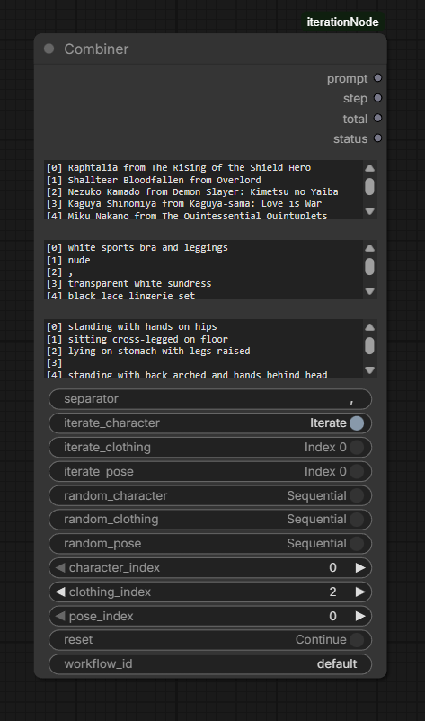

# ComfyUI-iterationNode

A custom node for [ComfyUI](https://github.com/comfyanonymous/ComfyUI) that combines prompts from multiple categories (characters, clothing, poses) and automatically advances through every combination across queue runs. Perfect for batch generation of variations without rebuilding the workflow each time.



## Features

- **3 independent prompt categories** — characters, clothing, poses (one item per line).
- **Per-category modes** — each category can independently be set to `Iterate` (sequential), `Random`, or `Fixed index`.
- **Automatic advancement** — each press of *Queue Prompt* outputs the next combination; no manual stepping required.
- **Full Cartesian product** — when multiple categories iterate, the node walks through every combination (e.g. 3×4×4 = 48 unique prompts).
- **Stateful counter** — keyed by `workflow_id`, so multiple Combiner nodes in the same workflow don't interfere.
- **Status output** — human-readable string showing current step, totals, and the active item from each category.
- **Zero dependencies** — pure Python, single file, no `pip install` required.

## Installation

### Option A — Manual (recommended)

1. Open a terminal inside your ComfyUI `custom_nodes` directory:
   ```
   cd ComfyUI/custom_nodes
   ```
2. Clone this repository:
   ```
   git clone https://github.com/ilia-zykov/ComfyUI-iterationNode.git
   ```
3. Restart ComfyUI.
4. The node appears in the node menu under the category **iteration → Combiner**.

### Option B — Download ZIP

1. Click `Code → Download ZIP` on the GitHub page.
2. Extract into `ComfyUI/custom_nodes/` — you should end up with `ComfyUI/custom_nodes/ComfyUI-iterationNode/__init__.py`.
3. Restart ComfyUI.

### Option C — ComfyUI Manager

If you use [ComfyUI Manager](https://github.com/ltdrdata/ComfyUI-Manager), open *Install via Git URL* and paste the repository URL.

No additional Python packages are needed. The node works on Windows, Linux and macOS.

## Quick Start

1. Add a node: right-click → `Add Node → iteration → Combiner`.
2. Fill the three text fields (one item per line), for example:
   - **characters**: `Tohru` / `Kanna` / `Lucoa`
   - **clothing**: `maid outfit` / `school uniform` / `casual clothes`
   - **poses**: `standing` / `sitting` / `lying down`
3. Toggle **Iterate** on the categories you want to cycle through.
4. Connect the `prompt` output to your CLIP Text Encode (or any string input).
5. Press **Queue Prompt** repeatedly — each run outputs the next combination.

To run all combinations automatically, set the queue size to the value shown in the `total` output (or to `Auto Queue: instant` in the ComfyUI menu).

## Inputs

### Required

| Input | Type | Description |
|-------|------|-------------|
| `characters` | STRING (multiline) | One character per line. Empty lines are ignored. |
| `clothing`   | STRING (multiline) | One clothing item per line. |
| `poses`      | STRING (multiline) | One pose per line. |
| `separator`  | STRING            | String inserted between parts. Default: `", "`. |

### Optional

| Input | Type | Default | Description |
|-------|------|---------|-------------|
| `iterate_character` | BOOLEAN | `false` | Cycle through the characters list, one item per queue run. |
| `iterate_clothing`  | BOOLEAN | `false` | Cycle through the clothing list. |
| `iterate_pose`      | BOOLEAN | `false` | Cycle through the poses list. |
| `random_character`  | BOOLEAN | `false` | Pick a random character every queue run (overrides iterate). |
| `random_clothing`   | BOOLEAN | `false` | Pick a random clothing item every run. |
| `random_pose`       | BOOLEAN | `false` | Pick a random pose every run. |
| `character_index`   | INT     | `0`     | Manual index used when both Iterate and Random are off. |
| `clothing_index`    | INT     | `0`     | Manual index for clothing. |
| `pose_index`        | INT     | `0`     | Manual index for pose. |
| `reset`             | BOOLEAN | `false` | When `true`, resets the step counter to 0 on the next run. |
| `workflow_id`       | STRING  | `default` | Unique key for the internal counter. Use different IDs if you have several Combiner nodes. |

## Outputs

| Output | Type | Description |
|--------|------|-------------|
| `prompt` | STRING | Combined prompt string for the current step (e.g. `Tohru, maid outfit, sitting`). |
| `step`   | INT    | Current step number, 1-based. |
| `total`  | INT    | Total number of unique combinations. `0` means "infinite" (any random toggle is on). |
| `status` | STRING | Human-readable summary: step counter and the chosen item per category. Useful for previews. |

## Modes — How They Interact

Each category is independent and follows this priority:

```
Random ON  → pick a random item from the list
Random OFF + Iterate ON  → walk through the list sequentially
Random OFF + Iterate OFF → use the manual *_index value
```

If both `Random` and `Iterate` are on for the same category, **Random wins**.

If any category uses `Random`, the `total` output becomes `0` (the sequence is effectively infinite — there is no "end").

## Iteration Order

When multiple categories iterate, they form a nested loop. **The first category in the input order changes slowest, the last changes fastest.**

Example with `characters = [A, B]`, `clothing = [X, Y]`, `poses = [1, 2]`:

| Step | Character | Clothing | Pose |
|------|-----------|----------|------|
| 1    | A         | X        | 1    |
| 2    | A         | X        | 2    |
| 3    | A         | Y        | 1    |
| 4    | A         | Y        | 2    |
| 5    | B         | X        | 1    |
| 6    | B         | X        | 2    |
| 7    | B         | Y        | 1    |
| 8    | B         | Y        | 2    |

After step 8 the counter wraps to 1.

## Usage Examples

### 1. Iterate poses only

```
characters: Tohru
clothing:   maid outfit
poses:      standing
            sitting
            lying down
            jumping

iterate_pose: ON
```

→ 4 steps, same character and outfit each time, only the pose changes.

### 2. Full Cartesian product

```
characters: Tohru / Kanna
clothing:   maid outfit / school uniform
poses:      standing / sitting

iterate_character: ON
iterate_clothing:  ON
iterate_pose:      ON
```

→ 2 × 2 × 2 = 8 steps, every combination produced exactly once.

### 3. Random character, fixed rest

```
characters: Tohru / Kanna / Lucoa
clothing:   maid outfit
poses:      standing

random_character: ON
```

→ Each run gets a random character; clothing and pose stay fixed. `total` output is `0` (infinite).

### 4. Manual selection (no iteration, no random)

```
characters: Tohru / Kanna / Lucoa
clothing:   maid outfit / school uniform
poses:      standing / sitting

character_index: 1   (Kanna)
clothing_index:  0   (maid outfit)
pose_index:      1   (sitting)
```

→ Always outputs `Kanna, maid outfit, sitting` regardless of how many times you run the queue.

## State and Reset

- The step counter is stored in memory, keyed by `workflow_id`.
- It persists across queue runs **within the same ComfyUI session**.
- It is **lost on ComfyUI restart**.
- Set `reset: true` to force the counter back to 0 on the next run.
- When the counter reaches `total`, it automatically wraps back to 0.

If you have multiple Combiner nodes that should advance independently, give each one a different `workflow_id` (for example `id_a`, `id_b`).

## Troubleshooting

**The node always outputs the same prompt.**
Make sure at least one `iterate_*` or `random_*` toggle is on. With all toggles off, the node uses the fixed `*_index` values and is therefore intentionally static.

**I changed the inputs but the node still shows old fields.**
ComfyUI caches input definitions. Delete the node from the graph and add a fresh one.

**The counter doesn't advance.**
Verify that the node is actually re-executing on each queue run. The node returns `IS_CHANGED = NaN` to force this; if you wrap it in a custom node that caches outputs, advancement may stop.

**Multiple Combiner nodes step in lockstep.**
They share state via `workflow_id`. Set a different `workflow_id` on each node.

## File Structure

```
ComfyUI-iterationNode/
├── __init__.py        # node logic
├── web/
│   └── line_numbers.js   # adds line numbers to the multiline text inputs
├── assets/
│   └── preview.png       # screenshot used in this README
└── README.md
```

## License

MIT — do whatever you want, no warranty.
